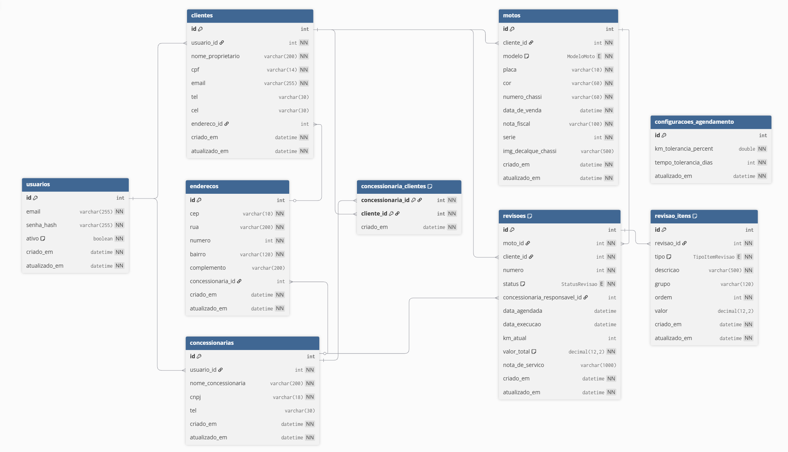

# 🏍️ Sistema de Gestão de Revisões de Motocicletas

## 📌 Sobre o Projeto

Este projeto consiste em um sistema completo de **gestão de revisões periódicas de motocicletas**, conectando **Clientes** e **Concessionárias** em um fluxo estruturado de manutenção preventiva.

O sistema permite:

- Cadastro e autenticação de usuários (Cliente ou Concessionária)
- Registro de motocicletas
- Geração automática do plano completo de revisões (1 a 47)
- Agendamento e execução de revisões
- Controle de itens (peças e serviços)
- Geração de nota de serviço
- Validação de regras de tolerância de KM e tempo
- Gestão de vínculo entre cliente e concessionária

---

## Banco de Dados

## 🧱 Arquitetura

O projeto foi modelado com separação clara de responsabilidades:

- **Models (Domínio)** → Representam as entidades persistidas no banco
- **Services (Application Layer)** → Contêm as regras de negócio
- **Providers** → Carregam regras fixas (JSON)
- **Banco de Dados Relacional** → Estruturado via DBML

A modelagem segue princípios de:

- Separação de camadas (Domain / Application)
- Baixo acoplamento
- Regras de negócio centralizadas
- Normalização de banco
- Controle de integridade relacional

---

## 👥 Perfis do Sistema

### 👤 Cliente

- Cadastra e gerencia suas motocicletas
- Visualiza próximas revisões
- Solicita agendamento
- Acompanha status das revisões

### 🏢 Concessionária

- Gerencia seus endereços
- Confirma agendamentos
- Executa revisões
- Gera nota de serviço
- Cria vínculo com clientes

---

## 🔁 Fluxo Principal

1. Cliente realiza cadastro
2. Cliente cadastra uma motocicleta
3. Sistema gera automaticamente todas as revisões previstas
4. Cliente solicita agendamento
5. Concessionária confirma o agendamento
6. Revisão é executada
7. Nota de serviço é gerada
8. Sistema calcula a próxima revisão e possíveis alertas

---

## 📊 Entidades Principais

- `Usuario`
- `Cliente`
- `Concessionaria`
- `Moto`
- `Revisao`
- `RevisaoItem`
- `ConfiguracaoAgendamento`

---

## ⚙️ Regras de Negócio

- Cada moto possui uma sequência fixa de revisões numeradas
- Uma revisão por número por moto (unicidade garantida)
- Revisão pode estar nos seguintes status:
    - `Pendente`
    - `Agendada`
    - `Executada`
    - `Cancelada`
- Tolerâncias de KM e tempo são configuráveis
- Manual de revisões é carregado via configuração global

---

## 🗄️ Banco de Dados

O banco foi modelado utilizando **DBML**, garantindo:

- Integridade referencial
- Relacionamentos 1:1, 1:N e N:N
- Controle de unicidade (CPF, CNPJ, placa, chassi)
- Estrutura preparada para expansão futura

---

## 🎯 Objetivo Acadêmico

O projeto foi desenvolvido com foco em:

- Modelagem orientada a domínio
- Separação de responsabilidades
- Aplicação de boas práticas arquiteturais
- Estruturação consistente de banco de dados
- Simulação de um cenário real de negócio
